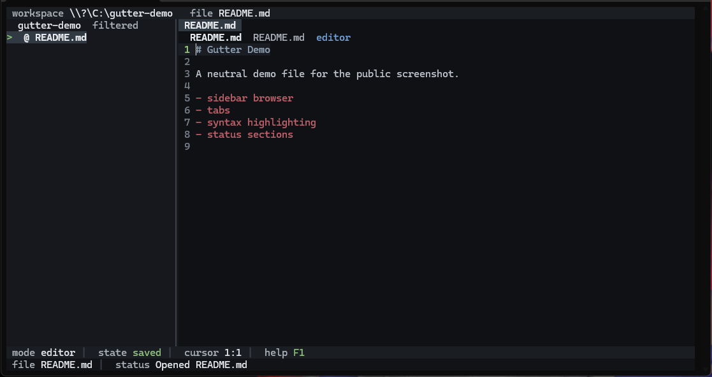

# Gutter

Gutter is a Windows terminal text editor built with Rust, `ratatui`, and `crossterm`.

It is an early but usable project editor with a sidebar browser, multi-file tabs, autosave, quick open, command palette, in-file find and replace, session restore, mouse support, and syntax highlighting.



## Features

- workspace-oriented file browser with keyboard and mouse navigation
- explorer-style folder navigation with parent-directory movement
- multi-file tabs with stable open order
- autosave plus explicit save and save-as flows
- quick open with `Ctrl+P`
- command palette with `Ctrl+Shift+P`
- in-file find and replace with `Ctrl+F` and `Ctrl+H`
- syntax highlighting for common source, config, and script formats
- session restore for the last workspace and open files
- shortcut overview with `F1`

## Build

```powershell
cargo build --release
```

The release binary is written to:

```text
target\release\gutter.exe
```

## Run

```powershell
cargo run -- [PATH]
```

or run the built executable directly:

```powershell
.\target\release\gutter.exe [PATH]
```

- if `PATH` is a directory, Gutter opens that workspace
- if `PATH` is a file, Gutter opens its parent workspace and focuses the file
- if no `PATH` is provided, Gutter restores the last workspace when available, otherwise it opens the current directory

## Default Shortcuts

- `F1`: shortcut overview
- `Ctrl+P`: quick open
- `Ctrl+Shift+P`: command palette
- `Ctrl+S`: save
- `Ctrl+W`: close current file
- `Ctrl+Tab`, `Ctrl+Left`, `Ctrl+Right`: switch tabs
- `Ctrl+F`: find
- `Ctrl+H`: replace
- `Ctrl+G`: go to line
- `F8` or `Ctrl+.`: show or hide filtered files

## Configuration

Gutter stores configuration in:

- Windows: `%APPDATA%/gutter/config.toml`

Supported keys:

```toml
theme = "base16-ocean.dark"
tab_width = 4
line_numbers = true
autosave = true
autosave_ms = 1000
show_hidden = false
```

Session state is stored at `%APPDATA%/gutter/session.json`.

## Status

Gutter is still early-stage software. The current focus is editor usability, file navigation, readability, and release polish.

## License

[MIT](LICENSE)
